# Google Play Store Publishing Materials: AetherScreen

This document compiles the copywritings, metadata details, and design specifications required to publish AetherScreen on the Google Play Store.

---

## 📝 Store Listing Metadata

### 1. App Title (Max 30 characters)
> **AetherScreen: Dim & Lock**

### 2. Short Description (Max 80 characters)
> **Preserve background audio, save OLED battery, and lock touch screen controls.**

### 3. Full Description (Max 4,000 characters)
```text
AetherScreen is the ultimate system utility designed for Android enthusiasts who value battery optimization, OLED screen preservation, and seamless passive media consumption. 

Have you ever wanted to fall asleep listening to a long podcast, cook while listening to a video recipe, or play background music from browser-based players—all without keeping your bright screen active? Standard video players and browsers pause media as soon as your display goes to sleep.

AetherScreen solves this perfectly. By rendering an ultra-focused, hardware-optimized system overlay, AetherScreen allows you to dim, control, or completely turn off the display matrix (turning off black pixels completely on OLED/AMOLED screens) while strictly preserving active background media execution!

Key Features:
• OLED Blackout: Overlay the screen in pure black (#000000). On OLED and AMOLED displays, black pixels draw zero power, effectively shutting down the display matrix to save battery.
• Dim Mode: Translucent overlay with adjustable transparency (10% to 95%). Clicks pass through, allowing you to use your apps in ultra-dim environments.
• Pocket / Proximity Lock: Prevents accidental pocket clicks by locking the touch screen during blackout. Dismisses securely via simple gestures (Double-tap to wake or Shake to wake).
• Auto-Pause Sleep Timer: Fades out the screen and sends system key commands to pause active background audio when the timer runs out. Preset for 15, 30, 45, or 60 minutes.
• Smart Sensor Triggers: Automatically enters blackout when placed face down on a surface or slipped into a pocket.
• Per-App Rules: Show floating overlay shortcuts automatically when your chosen media, video, or podcast apps are running in the foreground.

Cross-Device Companion Ecosystem:
• Android TV Screensaver: Start blackout on your Smart TV to save electricity and prevent screen burn-in while listening to music. Features a shifting dim bedside digital clock that changes positions every 60 seconds to completely avoid static pixel damage. Remote D-pad clicks wake up the screen instantly.
• Wear OS Remote Control: Remote-control and toggle screen blackout or add time on your phone or TV directly from your smartwatch.

Privacy-First:
AetherScreen processes all sensor information, usage statistics, and overlay rendering locally on-device. No personal data is collected, stored, or transmitted.
```


---

## 🎨 Graphics & Assets Planner

### 1. App Icon (512x512 PNG, Max 1MB)
*   **Visual Description**: A dark circular backdrop representing space/ether, with a stylized glowing purple power ring enclosing a secure lock symbol. A subtle magenta gradient highlights the edges.
*   **Style**: Premium, glassmorphic, modern.

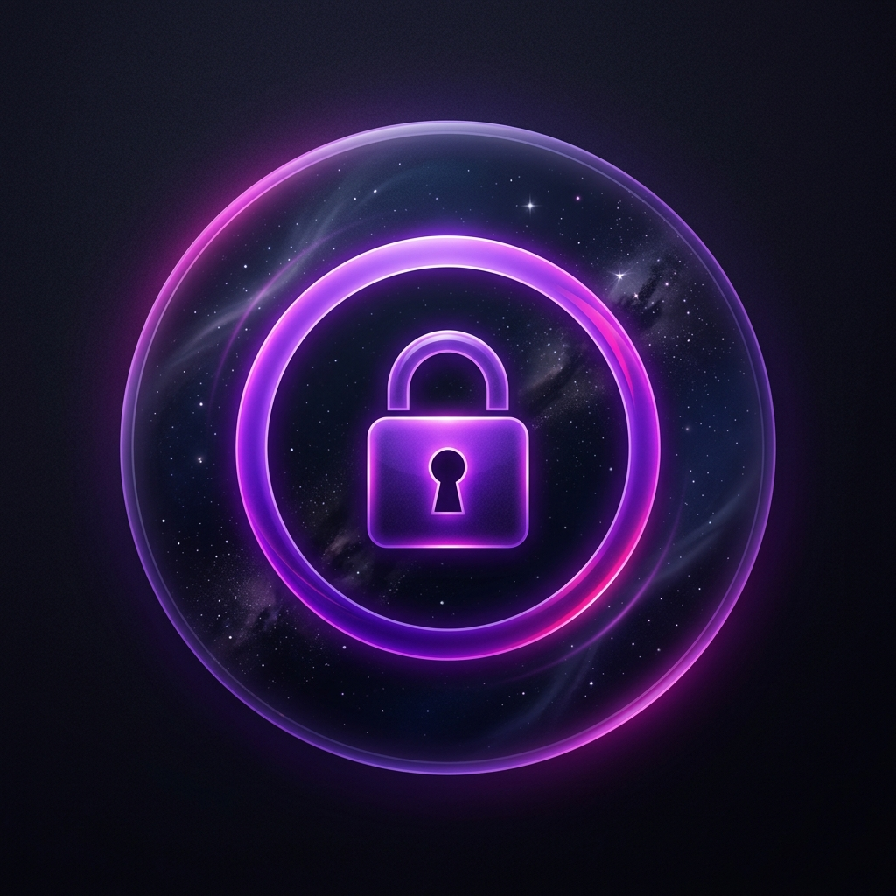

### 2. Feature Graphic (1024x500 PNG)
*   **Visual Description**: A split mock-up showing a sleek smartphone half-blacked out and a smartwatch remote toggle. The background uses a premium dark indigo gradient with glowing neon highlights. Prominent text: *"Preserve Audio, Blackout Pixels"*.

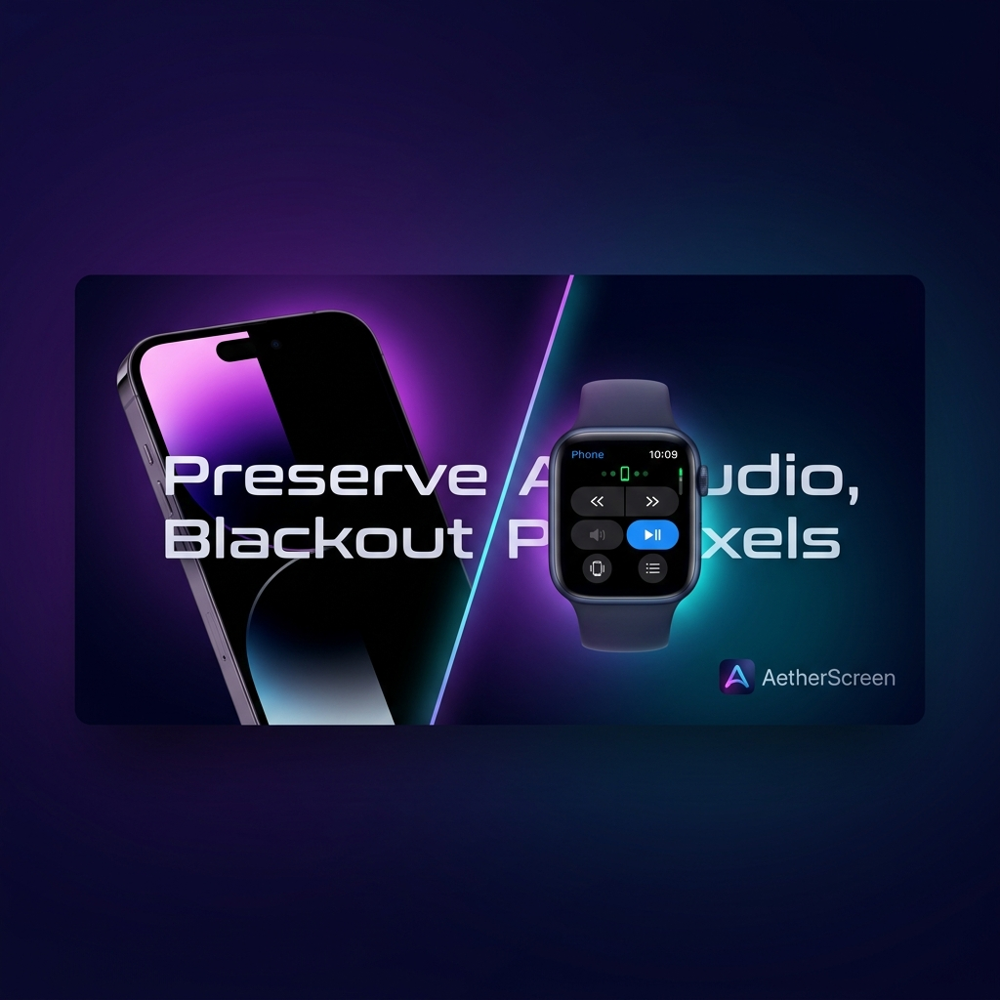

### 3. App Screenshots (Actual Captured Assets)

Here are the actual captured assets ready to upload:

#### Mobile Phone Screenshots
*   **Screenshot 1: Onboarding Welcome Screen**
    *   Text: *"Welcome to AetherScreen - Preserve Audio & Save Battery"*
    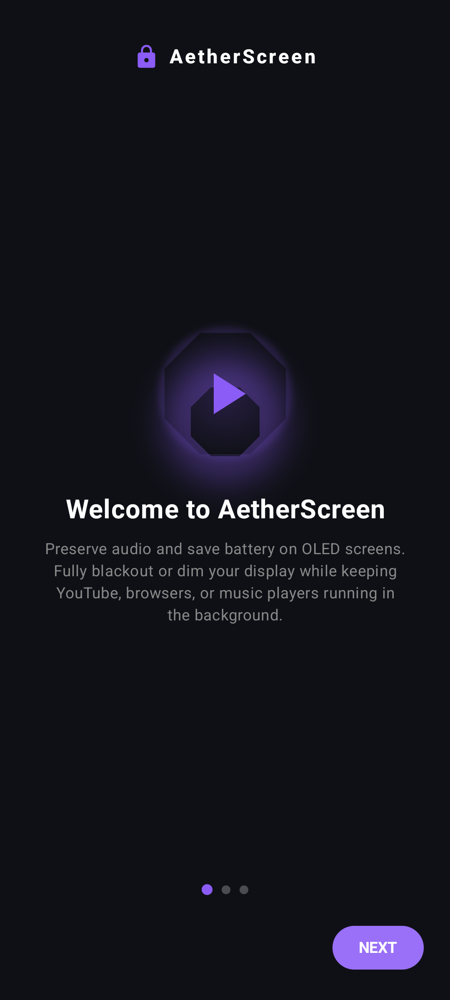
*   **Screenshot 2: Wake Gestures Onboarding**
    *   Text: *"Sleek double-tap and shake gesture triggers"*
    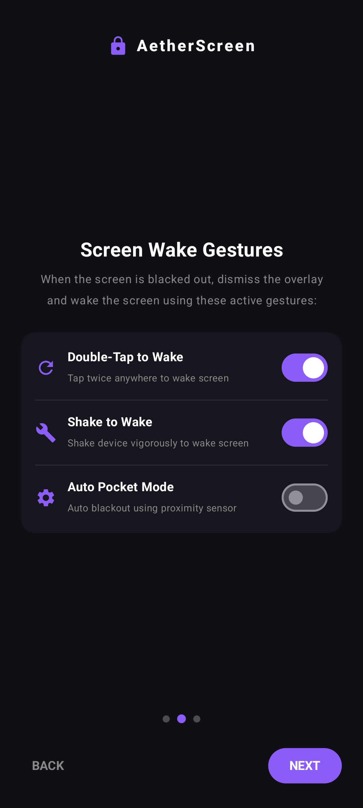
*   **Screenshot 3: Permission Guides**
    *   Text: *"Clear overlay permission status & custom guidelines"*
    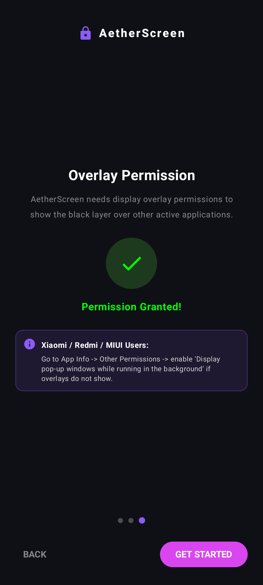
*   **Screenshot 4: Main Mobile Dashboard**
    *   Text: *"Toggle Screen Blackout & adjust dim settings"*
    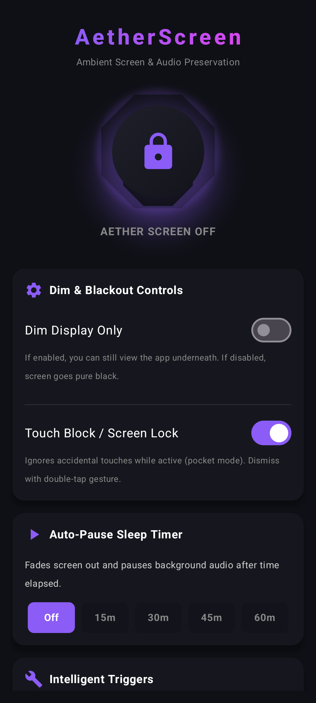
*   **Screenshot 5: Scrolled Dashboard Settings**
    *   Text: *"Pocket modes, shake/double-tap wake & target media applications"*
    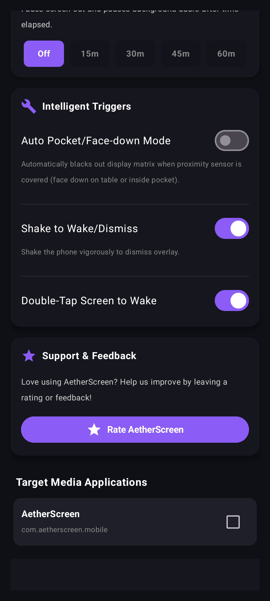

#### Android TV Screenshots
*   **Screenshot 6: TV Launcher Dashboard**
    *   Text: *"D-pad optimized screensaver & blackout activation"*
    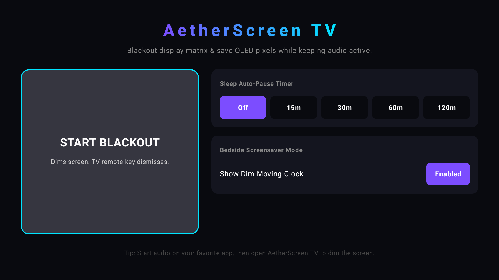
*   **Screenshot 7: TV Screensaver Ambient Bedside Clock**
    *   Text: *"OLED burn-in prevention clock with shifting pixel positions"*
    

#### Tablet Screenshots (Landscape 10-inch)
*   **Screenshot 8: Tablet Main Dashboard**
    *   Text: *"Widescreen control layout for display dimming & touch locks"*
    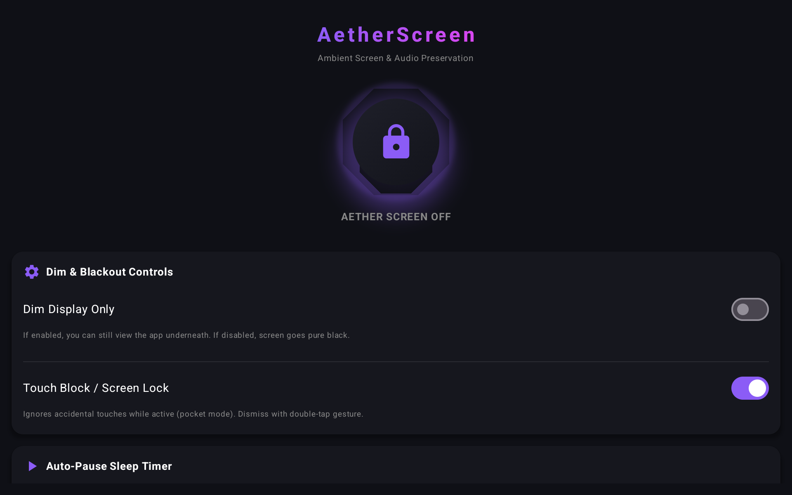
*   **Screenshot 9: Tablet Settings & Triggers**
    *   Text: *"Setup proximity sensor triggers & sleep timers"*
    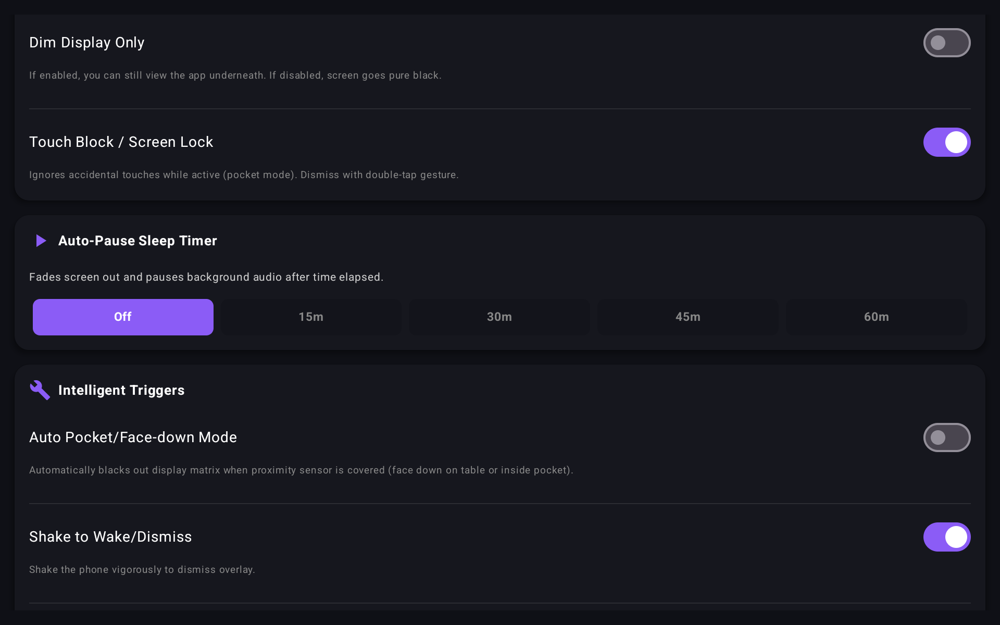
*   **Screenshot 10: Tablet Target Media Applications**
    *   Text: *"Select background media and music applications"*
    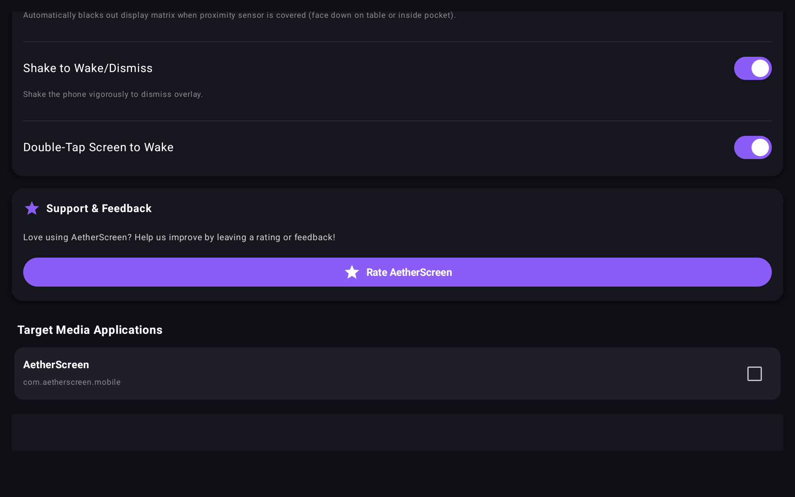

#### Wear OS Smartwatch Screenshots
*   **Screenshot 11: Wear OS Dashboard (Idle)**
    *   Text: *"Remote control interface for phone and TV"*
    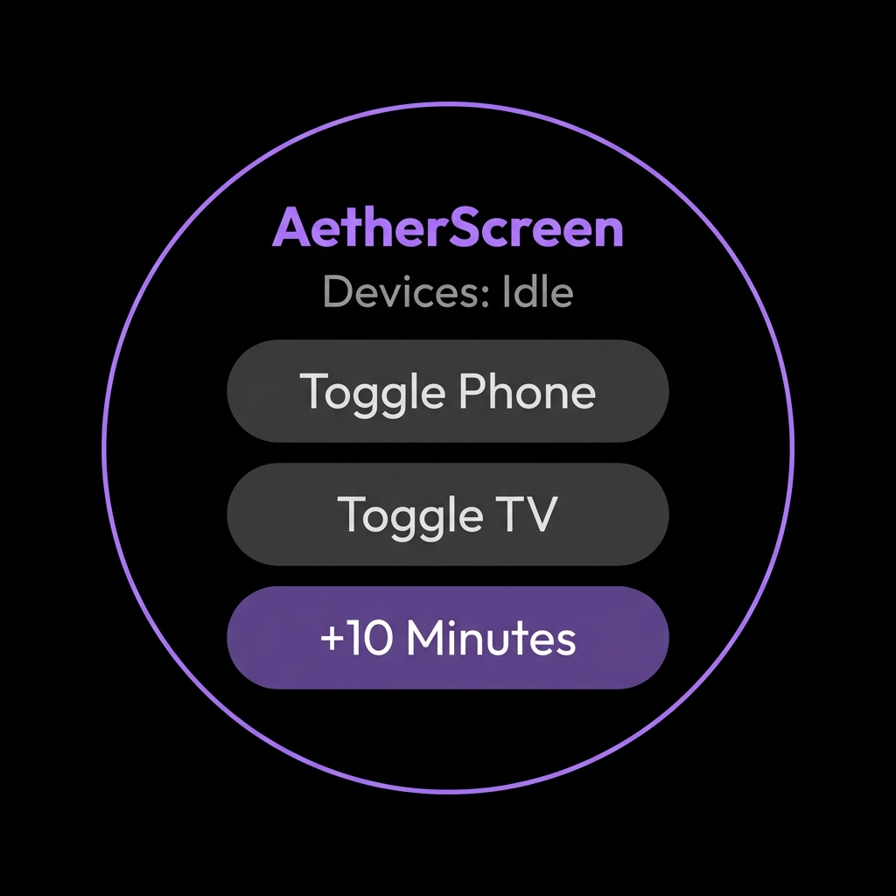
*   **Screenshot 12: Wear OS Dashboard (Active)**
    *   Text: *"Real-time remote toggle & connection state tracking"*
    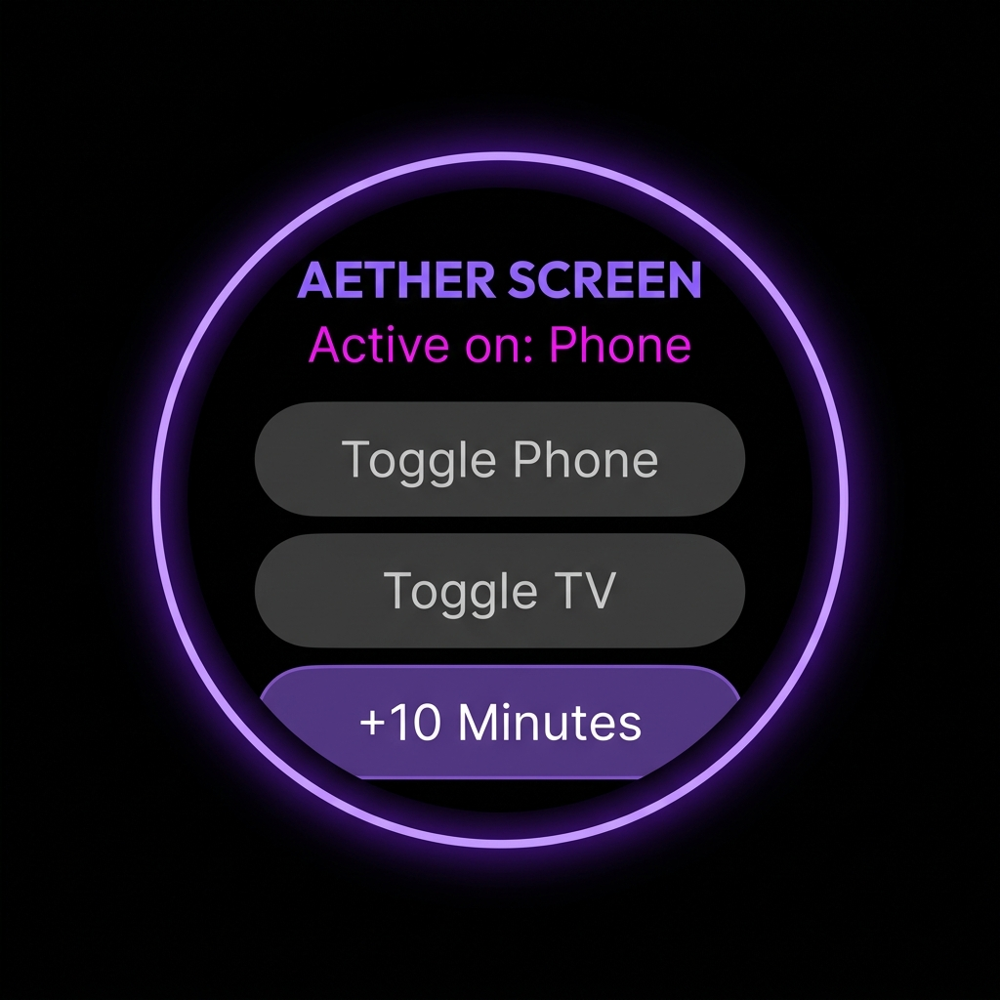
